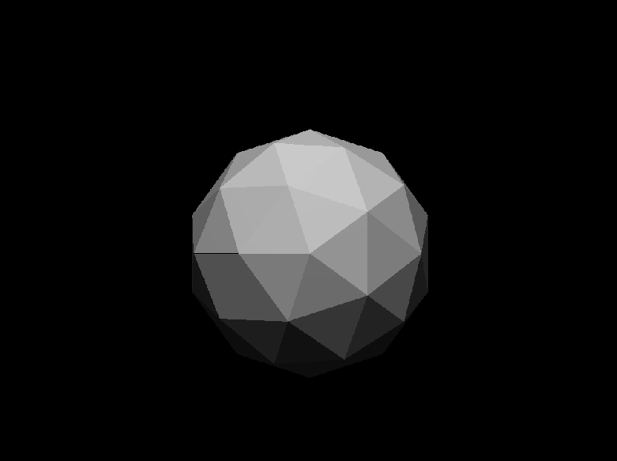

# Broengine

BroEngine / BrosEngine ? whatever. Made by two bros.

# Coordinate system: 
    Origin is where the Eye is (0, 0, 0)

    -------------> X
    |
    |
    |
    Y is oriented down (same as SDL)

    Z follows the right hand rule (goes up from your eyes to the screen)


# Rendering result

A simple sphere (so beautifuul !!)



=======
# Installation

Install golang, then:
(Ubuntu working example)
```
sudo apt install libsdl2-2.0-0 libsdl2-dev

go install
```
then do `go run main.go`

=======
# Testing

Run the tests with `go test -v ./...`

Run the benchs (and tests) with `go test -v ./... -bench`

Run the tests without display tests with `go test -short ./... -v`
