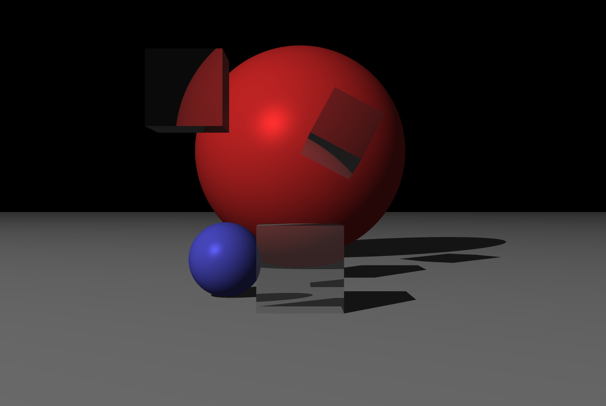

# render3d, Project Babbage first edition.

The idea for this edition was to build a 3D renderer to understand important concepts in this field.
Our ray tracing algorithm implementation relies on CPU power so the rendering is not expected to be time efficient at this stage.
Take a look at those beautiful colors and at that beautiful glass material below!

## Result example



## Installation

### On Debian based distributions

Install golang, then:
```
sudo apt install libsdl2-2.0-0 libsdl2-dev

go install
```

### On Arch based distributions

Do
```
sudo pacman -Syu --needed go sdl2

go install
```

## Rendering the current scene

Do `go run main.go`

You can change the current scene in `main.go`.


## Testing

Run the tests with `go test ./...`

Run the benchs (and tests) with `go test ./... -bench .`

Run the tests without display tests with `go test -short ./...`

Run a specific test (here called TestNewScreen):

`go test -run TestNewScreen render3d/render`

you must specify the package it's in (render3d/render)

## Scene configuration

Check the default config at config/config.go.
The screen is at D (+Z axis) from the eye (`D=2` in the default config).
Hence you need to put the object after `Z=2` to see it on the rendered image.
SaveAsPNG is at false by default. Set to true to save the rendered image to output/rendered.png.

## Documentation

To generate a package doc (render package here), do:
```
go doc -all render
```

## Coordinate system used

Same system as SDL.

    o -- + X
    |
    +
    Y

Z follows the right hand rule (goes up from your eyes to the screen)

Origin (o) is where the Eye is : (0, 0, 0).
