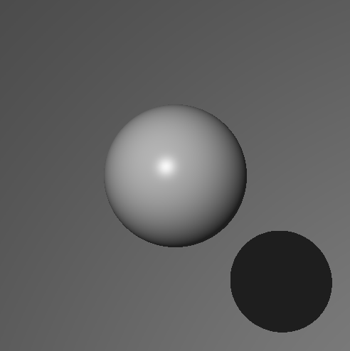

# Broengine

3D Rendering from scratch.

## Coordinate system:

    Origin is where the Eye is (0, 0, 0)

    -------------> X
    |
    |
    |
    Y is oriented down (same system as SDL)

    Z follows the right hand rule (goes up from your eyes to the screen)

## Rendering result

A true sphere.



## Installation

Install golang, then:
(Ubuntu working example)
```
sudo apt install libsdl2-2.0-0 libsdl2-dev

go install
```
then do `go run main.go`

## Testing

Run the tests with `go test -v ./...`

Run the benchs (and tests) with `go test -v ./... -bench`

Run the tests without display tests with `go test -short ./... -v`

Run a specific test (here called TestNewScreen):

`go test -run TestNewScreen broengine/render`

you must specify the package it's in (broegine/render)

## Documentation

To generate a package doc (render package here), do:
```
go doc -all render
```